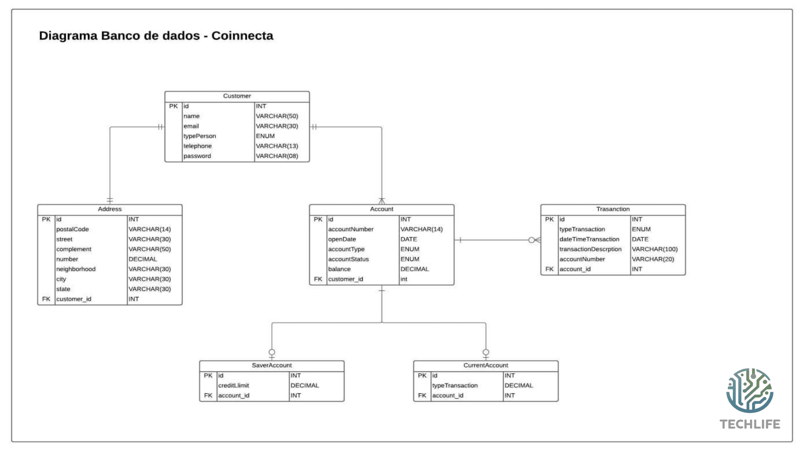
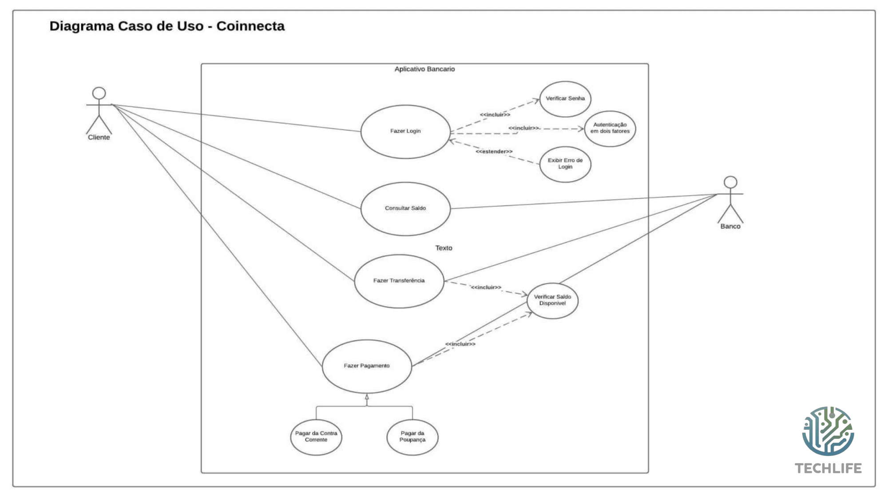

# Diagramas

## Diagrama UML

Proporciona uma visualização detalhada da arquitetura e interações do sistema, garantindo uma compreensão clara de como as diferentes partes se conectam e funcionam juntas.

## Diagrama de Banco de Dados

Uma representação visual da estrutura do banco de dados, incluindo tabelas, campos e relacionamentos, para garantir uma organização eficiente e segura dos dados financeiros.

## Diagrama de Caso de Uso

Descreve as interações entre os usuários e o sistema, identificando as funcionalidades chave oferecidas pela plataforma Coinnecta e como elas são utilizadas pelos usuários.

## Diferenciais do Coinnecta

- A segurança da aplicação será a autenticação de dois fatores.
- Com o nosso cartão de crédito, os seus pontos poderão ser revertidos para Bitcoin (cashback de 0.3% revertido para criptomoeda).
